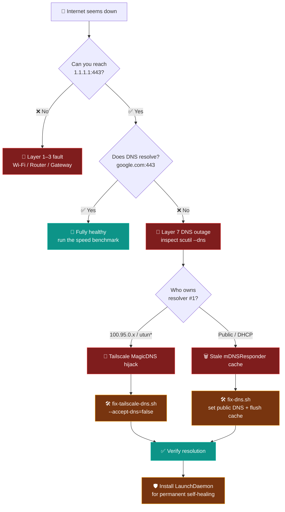
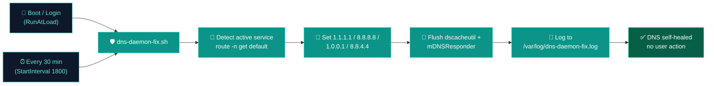

# 🌐 Connectivity Checker & Universal DNS Fixer

<p>
  
  
  
  
  
</p>

An incident post-mortem, diagnostic suite, and interactive triage toolkit for diagnosing macOS & Linux connectivity failures where **Layer 3 IP routing works** (`1.1.1.1:443`), but **Layer 7 DNS resolution fails** (`google.com:443`) due to router DNS timeouts or Tailscale MagicDNS resolver hijacks.

🔗 **Live Web Dashboard:** [https://rifaterdemsahin.github.io/connectivity-checker/](https://rifaterdemsahin.github.io/connectivity-checker/)
📄 **Reports Page:** [https://rifaterdemsahin.github.io/connectivity-checker/reports.html](https://rifaterdemsahin.github.io/connectivity-checker/reports.html) · [reports/](reports/)

---

## 📑 Table of Contents

| | Section | What you'll find |
| :---: | :--- | :--- |
| 🧭 | [How It Works](#-how-it-works--visual-triage-flow) | Visual triage flow + network topology diagram |
| ⚡ | [Instant Emergency Commands](#-instant-emergency-commands) | One-liner, scripts, and permanent auto-fix |
| 📱 | [Mobile / Gemini Runbook](#-mobile-phone--gemini-mobile-emergency-runbook) | Phone-AI troubleshooting when fully offline |
| 📖 | [The Incident Story](#-the-incident-story) | Symptom → clue → root cause → resolution |
| 🛠 | [Included Scripts](#-included-diagnostic--recovery-scripts) | Every diagnostic & repair script explained |
| 📊 | [Infrastructure Benchmark](#-infrastructure-benchmark-ee-over-bt-vs-virgin-media) | EE Full Fibre vs Virgin Media |
| 💡 | [Quick Tips](#-quick-tips-for-macos--tailscale) | Tailscale aliases & DNS best practice |
| 📂 | [Project Structure](#-project-structure) | File-by-file repository map |
| 🚀 | [GitHub Pages](#-github-pages-setup) | Live deployment details |

---

## 🧭 How It Works — Visual Triage Flow

The whole project follows one simple idea: **separate the physical network (Layer 3) from name resolution (Layer 7)**. Follow the flow to go from symptom to fix in under a minute.

### 🔀 Decision Flow



### 🗺️ Network Topology (what actually broke)

```text
                         ┌─────────────────────────────────────────────┐
                         │                THE INTERNET                  │
                         │   Cloudflare 1.1.1.1   ·   Google 8.8.8.8    │
                         └───────────────▲─────────────────────────────┘
                                         │
                                 ┌───────┴────────┐
                                 │   ISP / ONT    │  EE Full Fibre (BT Openreach)
                                 │ 192.168.1.254  │
                                 └───────▲────────┘
                                         │
                    ┌────────────────────┴────────────────────┐
                    │              📶 Wi-Fi Router              │
                    └────────────────────▲────────────────────┘
                                         │
                         ┌───────────────┴───────────────┐
                         │      💻 Your Mac  (en0)        │
                         │                               │
                         │  Layer 3 ✅  1.1.1.1 reachable │
                         │  Layer 7 ❌  google.com fails  │
                         └───────────────┬───────────────┘
                                         │
                         ┌───────────────▼───────────────┐
                         │   🦎 Tailscale  utun5          │
                         │   MagicDNS 100.95.0.251-254    │
                         │   order 104200  ⟵ THE HIJACK   │
                         └───────────────────────────────┘
```

> 💡 **Reading the diagram:** the packets can reach the internet perfectly (Layer 3 ✅), but the name lookups are being forced through Tailscale's unreachable MagicDNS resolver before they ever fall back (Layer 7 ❌).

### ⏱️ The 60-Second Recovery Path

```text
  🔍 DIAGNOSE            🛠️ REPAIR                 🛡️ PREVENT
  ───────────            ─────────                 ──────────
  ./check-connectivity   ./fix-dns.sh              install LaunchDaemon
  └─ shows layer fault   └─ public DNS + flush     └─ heals every 30 min
```

---

## ⚡ Instant Emergency Commands

### 🩹 1. One-Liner Fix (Copy & Paste into macOS Terminal)
Sets ultra-fast public DNS (Cloudflare + Google), flushes system cache, and restarts the DNS daemon:
```bash
sudo networksetup -setdnsservers Wi-Fi 1.1.1.1 8.8.8.8 1.0.0.1 8.8.4.4 && sudo dscacheutil -flushcache && sudo killall -HUP mDNSResponder
```
*(Note: Ensure `-setdnsservers` has the trailing `s`)*

### 🧰 2. Automated Diagnostic & Fixer Script
```bash
# Run comprehensive diagnostic
./check-connectivity.sh

# Run universal DNS fixer
./fix-dns.sh
```

### 🛡️ 3. Permanent Auto-Fix — LaunchDaemon (no more manual flushes)

The recurring failure is a stale resolver cache / `mDNSResponder` after boot or Wi-Fi reconnect — not the DNS settings reverting. Install `com.rifaterdemsahin.dnsfix` **once** (needs `sudo` once) and it re-asserts public DNS + flushes the cache automatically at every boot/login and every 30 minutes:

```bash
sudo cp com.rifaterdemsahin.dnsfix.plist /Library/LaunchDaemons/
sudo chown root:wheel /Library/LaunchDaemons/com.rifaterdemsahin.dnsfix.plist
sudo chmod 644 /Library/LaunchDaemons/com.rifaterdemsahin.dnsfix.plist
sudo chmod +x dns-daemon-fix.sh
sudo launchctl bootstrap system /Library/LaunchDaemons/com.rifaterdemsahin.dnsfix.plist
```

Full write-up, verification and rollback steps: [`reports/dns-daemon-permanent-fix.md`](reports/dns-daemon-permanent-fix.md).

#### 🔄 Daemon Lifecycle



---

## 📱 Mobile Phone & Gemini Mobile Emergency Runbook

When your laptop is completely offline or DNS-locked, you can use **Gemini on your mobile phone** (connected to cellular 4G/5G) to diagnose and generate exact recovery commands.

### 📋 Gemini Mobile Triage Prompt
Copy and paste this prompt into the Gemini app on your phone:

```text
I am troubleshooting network connectivity on my Mac. Here is my status:
- Layer 3 Direct IP: 1.1.1.1:443 connects successfully via nc / ping
- Layer 7 DNS Resolution: FAILED (google.com times out, Grok / Anthropic CLI fails)
- Active Interface: en0 (Wi-Fi)
- Tailscale / VPN status: Active or Recently Disconnected

Please give me:
1. The exact terminal command to set Cloudflare (1.1.1.1) and Google (8.8.8.8) DNS on macOS.
2. The command to flush the macOS DNS cache.
3. The step-by-step macOS System Settings GUI navigation path to configure DNS manually.
```

### 📱 Quick Mobile Steps (If you can't run scripts)
1. **macOS System Settings GUI Fix:**
   - Go to **System Settings** → **Wi-Fi**.
   - Click **Details...** next to your connected network.
   - Select **DNS** in the left sidebar.
   - Click `+` and add `1.1.1.1`, `8.8.8.8`, `1.0.0.1`, `8.8.4.4`.
   - Click **OK** → apply changes.
2. **Flush Cache:**
   - In Terminal: `sudo dscacheutil -flushcache; sudo killall -HUP mDNSResponder`
3. **Turn off Tailscale:**
   - If installed, click the Tailscale menu bar icon and select **Disconnect** (or `tailscale set --accept-dns=false`).

---

## 📖 The Incident Story

### 1️⃣ 🚨 The Symptoms
- Commands like `nslookup google.com`, `grok`, and `dig api.anthropic.com` timed out.
- Browsers could not open any web pages.

### 2️⃣ 🔎 The Breakthrough Finding
- Direct TCP connection to Cloudflare DNS IP succeeded:
  ```bash
  nc -zv 1.1.1.1 443
  # Connection to 1.1.1.1 port 443 [tcp/https] succeeded!
  ```
- Connecting to hostname failed on resolution:
  ```bash
  nc -zv google.com 443
  # nc: getaddrinfo: nodename nor servname provided, or not known
  ```
- **Conclusion:** Physical Wi-Fi and TCP/IP routing were fully operational. Only the DNS subsystem was failing.

```text
  ┌──────────────────────────────┬──────────────────────────────┐
  │   Layer 3  (by IP)  ✅        │   Layer 7  (by name)  ❌      │
  ├──────────────────────────────┼──────────────────────────────┤
  │  nc -zv 1.1.1.1 443          │  nc -zv google.com 443       │
  │  → Connection succeeded!     │  → getaddrinfo: nodename     │
  │                              │     nor servname provided    │
  └──────────────────────────────┴──────────────────────────────┘
         Routing is FINE  →  only NAME RESOLUTION is broken
```

### 3️⃣ 🦎 The Root Cause
Running `scutil --dns` revealed that Tailscale's virtual network interface (`utun*` at `100.96.0.2`) had registered Tailscale MagicDNS (`100.95.0.251-254`) as **Resolver #1 with Order 104200**, taking higher priority over the local Wi-Fi DNS resolver (`order 200000`).

Because Tailscale's upstream DNS node was unreachable, all DNS queries timed out before falling back.

```text
  scutil --dns  (BEFORE the fix)
  ─────────────────────────────────────────────
  resolver #1                          🔴 HIJACKED
    nameserver[0] : 100.95.0.251   ← Tailscale MagicDNS (unreachable)
    nameserver[1] : 100.95.0.252
    if_index      : utun5
    order         : 104200         ← wins over Wi-Fi

  resolver #2
    nameserver[0] : 1.1.1.1        ← correct, but never reached first
    order         : 200000
```

### 4️⃣ ✅ The Resolution
- Setting reliable public DNS servers (`1.1.1.1`, `8.8.8.8`) on the active network service (`Wi-Fi`) and flushing `mDNSResponder` restored connectivity immediately.

```text
  AFTER the fix
  ─────────────────────────────────────────────
  ✅ resolver #1 → 1.1.1.1 / 8.8.8.8 / 1.0.0.1 / 8.8.4.4
  ✅ utun5 MagicDNS unregistered
  ✅ nc -zv google.com 443  →  Connection succeeded!
  ✅ ./check-connectivity.sh  →  4/4 domains resolved
```

---

## 🛠 Included Diagnostic & Recovery Scripts

### 🔍 1. `check-connectivity.sh` — Full Diagnostic
Performs a 6-step automated health check:
1. Detects default route, active interface (`en0`, `utun*`), and local IP addresses.
2. Tests Layer 3 direct IP connectivity to `1.1.1.1` and `8.8.8.8`.
3. Tests Layer 7 DNS resolution comparing System Resolver vs Direct Anycast (`@1.1.1.1`).
4. Inspects `scutil --dns` hierarchy and active macOS DNS server settings.
5. Checks Tailscale CLI and daemon status.
6. Runs a colorful **speed & latency benchmark** (downlink/uplink bars via Apple `networkQuality`, with `curl` fallback).

After the six steps it prints a diagnosis summary and a **Gemini Mobile Triage Card** ready for copy-pasting into phone AI.

```bash
chmod +x check-connectivity.sh
./check-connectivity.sh
```

### 🛠️ 2. `fix-dns.sh` — Universal Repair
Automated repair utility:
- Auto-detects the active network service (e.g. `Wi-Fi`, `Ethernet`, `Thunderbolt Bridge`).
- Disables Tailscale MagicDNS hijacking (`--accept-dns=false`).
- Applies high-speed public DNS (`1.1.1.1`, `8.8.8.8`, `1.0.0.1`, `8.8.4.4`).
- Flushes macOS cache (`dscacheutil`, `mDNSResponder`).
- Verifies resolution against multiple live endpoints.

```bash
chmod +x fix-dns.sh
./fix-dns.sh
```

### 🚀 3. `speedtest.sh` — Throughput Benchmark
Benchmarking utility to test downlink/uplink capacity, latency, and RPM responsiveness using macOS native `networkQuality` (with `curl` fallback) and identify your infrastructure (EE Full Fibre over BT Openreach Core).

```bash
chmod +x speedtest.sh
./speedtest.sh
```

### 🦎 4. `fix-tailscale-dns.sh` — VPN DNS Reset
Tailscale-focused reset script for disabling VPN DNS overrides and flushing cache.

```bash
chmod +x fix-tailscale-dns.sh
./fix-tailscale-dns.sh
```

---

## ⚡ Infrastructure Benchmark: EE over BT vs Virgin Media

| Feature / Metric | EE Full Fibre (FTTP over BT Openreach) | Old Virgin Media (DOCSIS 3.0 / 3.1) |
| :--- | :--- | :--- |
| **Physical Medium** | Pure optical glass fiber direct to ONT | Hybrid Fibre-Coaxial (HFC copper street tree) |
| **Edge Ping Latency** | **8.3 ms – 9.5 ms** (UK Edge / BBC / Google) | 22.0 ms – 35.0+ ms |
| **Tested Upload Speed**| **78.3 Mbps** (~4x Virgin cable tiers) | ~20 – 25 Mbps |
| **Tested Download** | **237.7 Mbps** | 125 – 250 Mbps |
| **Street Contention** | Dedicated optical time-division | Shared neighborhood coaxial RF spectrum |
| **Packet Loss & Jitter**| **0.0%** packet loss, optical noise immunity | Prone to RF ingress & cabinet noise |

---

## 💡 Quick Tips for macOS & Tailscale

### 🔗 Add Tailscale CLI Alias
If Tailscale was installed via the Mac App Store, the CLI binary is at `/Applications/Tailscale.app/Contents/MacOS/Tailscale`. Add to your `~/.zshrc`:
```bash
alias tailscale="/Applications/Tailscale.app/Contents/MacOS/Tailscale"
```

### 🚫 Disable Tailscale DNS Override
To use Tailscale for subnet routing without overriding your public DNS:
```bash
tailscale up --accept-dns=false
```

---

## 📂 Project Structure

| File / Folder | Purpose |
| :--- | :--- |
| `check-connectivity.sh` | 6-step triage (interface → L3 → L7 DNS → `scutil` order → Tailscale → speed benchmark) + Gemini Mobile card. |
| `fix-dns.sh` | Universal repair: detects active service, disables Tailscale DNS, sets public DNS, flushes cache, verifies endpoints. |
| `fix-tailscale-dns.sh` | Targeted Tailscale DNS reset (`--accept-dns=false`) + cache flush + verification. |
| `speedtest.sh` | Standalone throughput/latency/RPM benchmark via Apple `networkQuality` (curl fallback). |
| `dns-daemon-fix.sh` | Worker script for the permanent LaunchDaemon (re-assert DNS + flush cache, logs each run). |
| `com.rifaterdemsahin.dnsfix.plist` | LaunchDaemon definition (`RunAtLoad` + every 30 min) for self-healing DNS. |
| `index.html` | Interactive dashboard: post-mortem, Fiber vs Virgin benchmark, decision tree, fixer cards, repository map. |
| `reports.html` + `reports/` | Reports hub and Markdown field reports (evidence, verification, rollback). |
| `virgin_vs_ee.jpeg` | Visual evidence from the line migration/benchmark. |
| `.github/workflows/deploy-pages.yml` | GitHub Actions workflow publishing the static site to GitHub Pages. |

---

## 🚀 GitHub Pages Setup

The site is published automatically by GitHub Actions ([`.github/workflows/deploy-pages.yml`](.github/workflows/deploy-pages.yml)) on every push to `main`.

1. Repository **Settings → Pages** is configured with **Source: GitHub Actions**.
2. Any push to `main` rebuilds and redeploys the site.
3. Live URLs:
   - Dashboard: `https://rifaterdemsahin.github.io/connectivity-checker/`
   - Reports: `https://rifaterdemsahin.github.io/connectivity-checker/reports.html`

To re-check or change the source manually: [GitHub Pages Settings](https://github.com/rifaterdemsahin/connectivity-checker/settings/pages).
